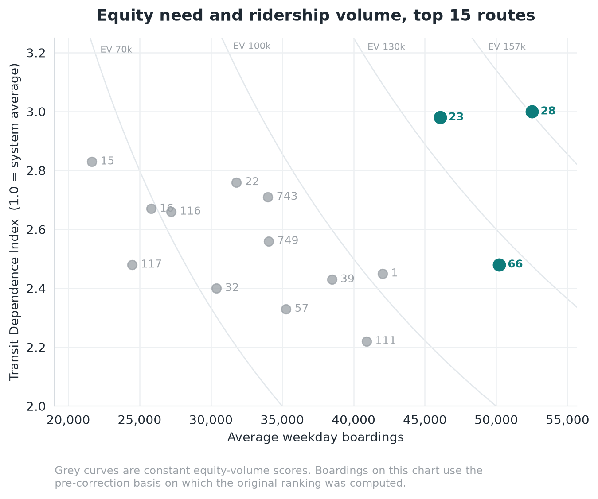
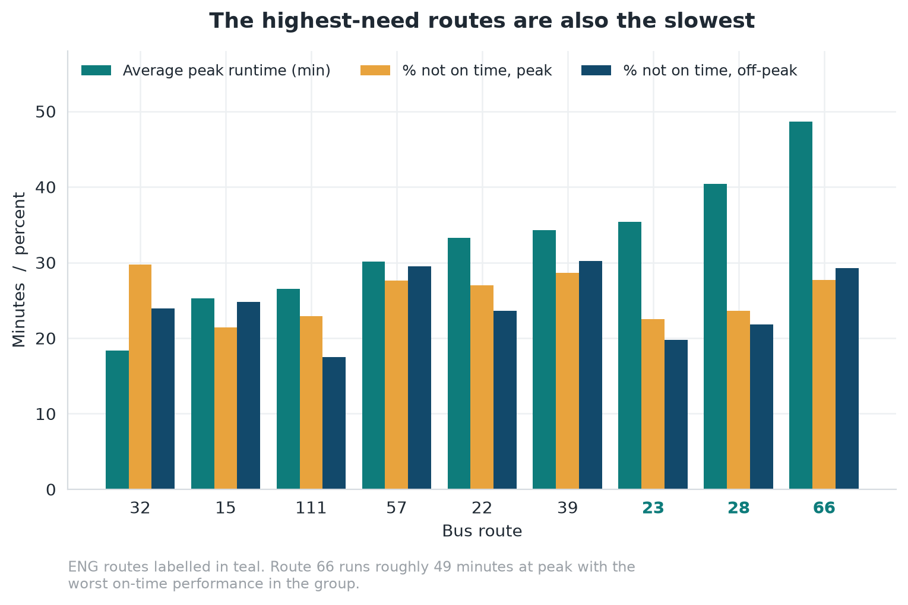
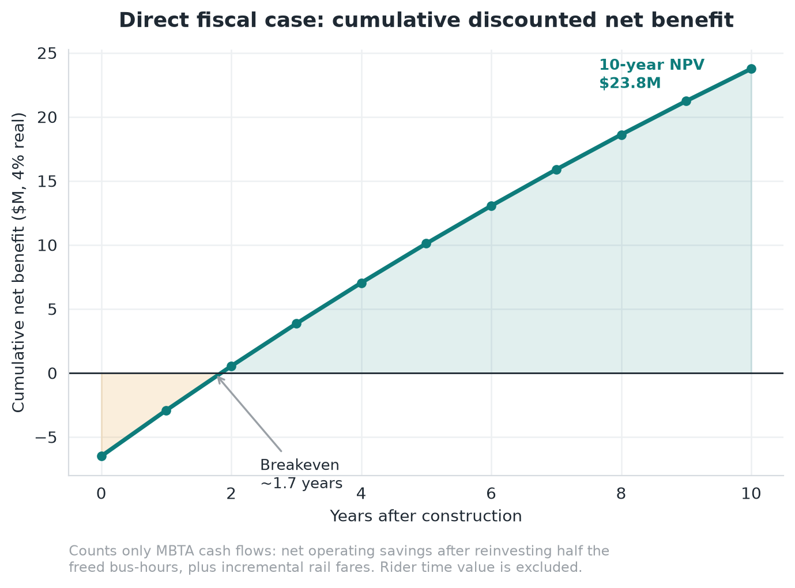
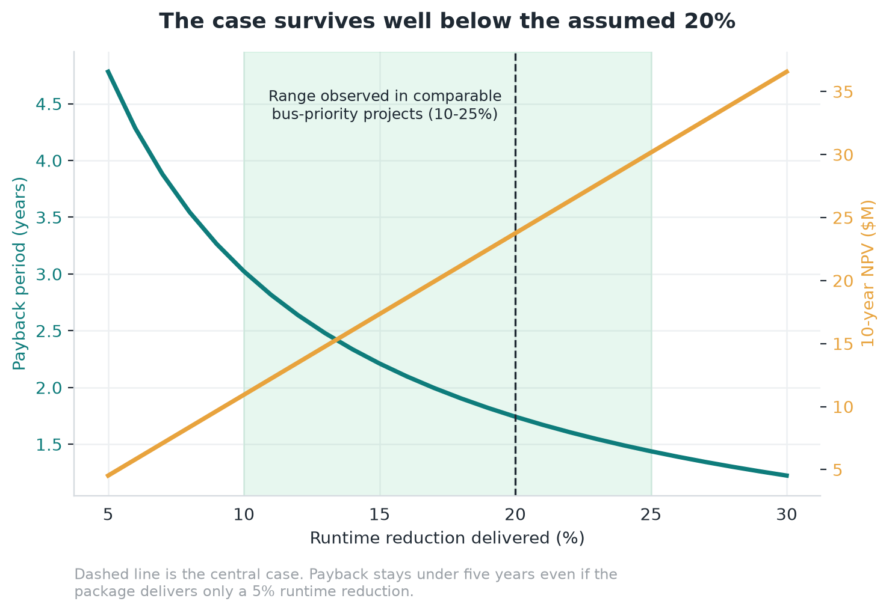
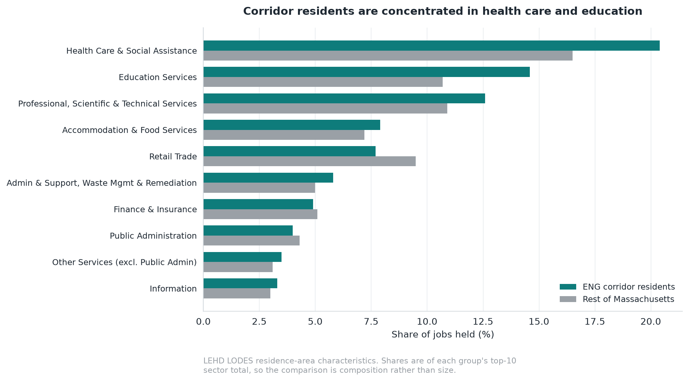
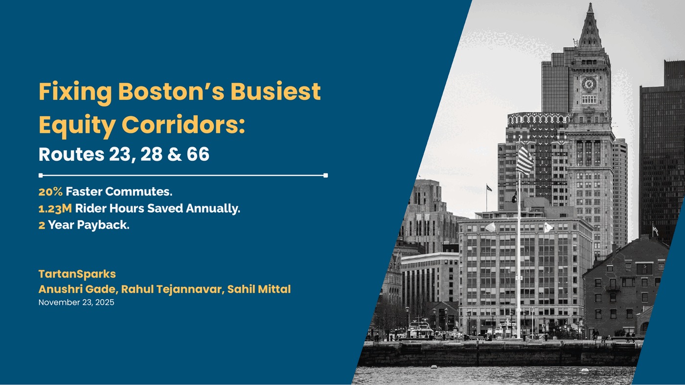
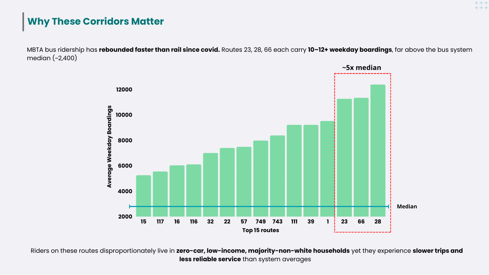
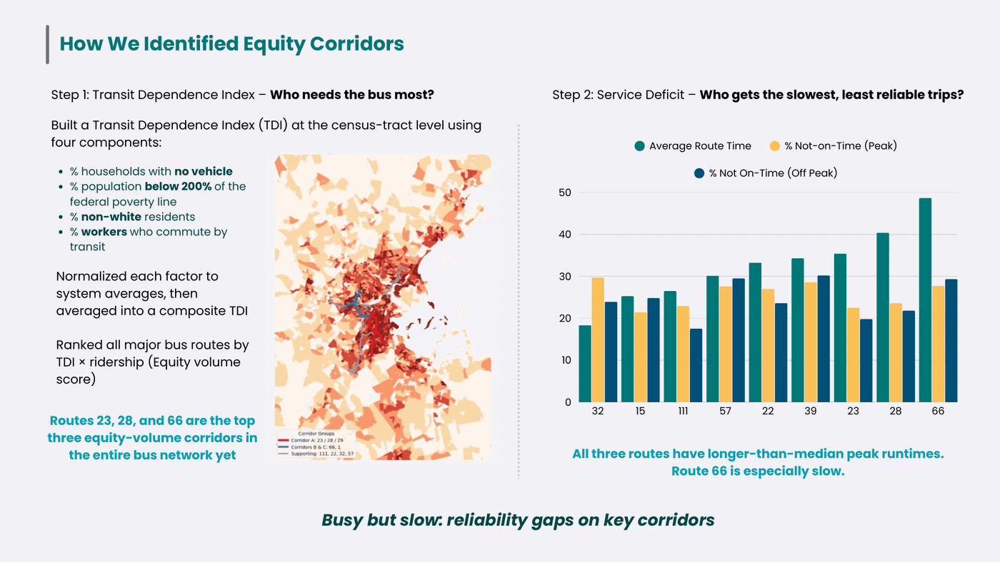
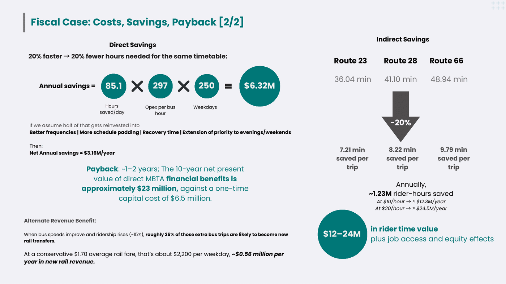

# Fixing Boston's busiest equity corridors

**A data-driven case for bus-priority investment on MBTA routes 23, 28 and 66.**

[](https://github.com/sahilmittal-policy/mbta-equity-corridors/actions/workflows/tests.yml)
[](https://www.python.org/)
[](LICENSE)

> 🥈 **Second place, MIT Policy Hackathon 2025** — Transportation track.
> Team TartanSparks: Anushri Gade, Rahul Tejannavar, Sahil Mittal.

---

Greater Boston's bus network carries the region's most transit-dependent riders
on some of its slowest and least reliable services. Black bus riders in Boston
spend roughly **64 more hours a year** in transit than white riders.

We asked which routes that penalty falls hardest on, whether it could be fixed
without a capital megaproject, and what fixing it would cost. The answer:

| | |
| --- | --- |
| **20%** | faster trips from a proven bus-priority package |
| **1.23M** | rider-hours returned every year |
| **$6.5M** | one-time capital cost |
| **1.7 years** | payback on MBTA cash flows alone |
| **$23.8M** | 10-year NPV, before counting any rider benefit |

Three routes — **28, 23 and 66** — rank first, second and third out of the
*entire* MBTA bus network when you weight ridership by transit dependence. They
are also among the slowest and least reliable routes in the system. That
coincidence is the whole argument.

<table>
<tr>
<td width="50%" valign="top">

### 📄 [The policy memo](docs/policy-memo.md)

The full submitted memo — recommendations, the index definitions, the fiscal
case, and both appendix tables. Renders in the browser, no download.

</td>
<td width="50%" valign="top">

### 📊 [The deck](docs/slides/)

All nine slides as presented to the judging panel, with a note on each.
Original PDF alongside.

</td>
</tr>
<tr>
<td width="50%" valign="top">

### 📈 [Full results](docs/results.md)

Every table and figure the analysis produced, in one place.

</td>
<td width="50%" valign="top">

### 🔬 [Methodology](docs/methodology.md)

How the corridor was chosen and how the fiscal case was built — including what
the indices get wrong.

</td>
</tr>
</table>

---

## The finding



We built a **Transit Dependence Index** for every bus route in the network —
population-weighted shares of no-vehicle households, residents below 200% of the
poverty line, non-white residents and transit commuters within an 800 m walkshed
of every stop, each normalised against the system average. A TDI of 3.00 means a
route's riders are three times as transit-dependent as the average MBTA rider.

TDI alone is a bad investment criterion: it rewards lightly-used shuttles through
very poor neighbourhoods. Ridership alone is equally bad: it rewards busy routes
through affluent ones. Multiplying them asks a blunter question — **where are the
most equity-weighted riders?**

That product reorders the ranking substantially. Route 15 has the second-highest
TDI in the top fifteen and ranks fourteenth on equity volume, because barely
anyone rides it. Routes 28, 23 and 66 come out on top.

Then we checked what service those riders actually get.



All three run longer than the median peak runtime. Route 66 takes nearly **49
minutes** at peak with the worst on-time performance in the group — on a route
where 60% of boardings happen within 400 m of a rail station.

**The more you depend on the bus, the more you are punished by slow and
unreliable service.**

## The fix, and what it costs

Not a megaproject. Dedicated lanes on congested segments, transit signal
priority, queue jumps at bottlenecks, far-side stops and stop consolidation —
tools Boston already deploys, at roughly $0.5M a mile in paint, posts and signal
software. Ten miles of treatment, $6.5M all in.

The model keeps three benefit buckets separate, because they are not the same
kind of money:

| Bucket | Per year | Counted in payback? |
| --- | ---: | --- |
| Net operating savings (after reinvesting half in service) | $3.16M | ✅ |
| New rail fare revenue from better bus–rail feeding | $0.56M | ✅ |
| Rider time value (1.23M hours at $10–20/hr) | $12.3–24.5M | ❌ |

Rider time is a societal benefit, not agency cash. Mixing the two into a payback
figure is how cost-benefit analyses get dismissed by the people who have to sign
them off. So payback and NPV use the first two buckets only — and it still pays
back in **1.7 years**.



### Does it hold up?

The interesting question isn't what the model says at the central case. It's how
far you have to push the assumptions before the recommendation breaks.



The package pays back inside five years even at a **5% runtime reduction** —
half the bottom of the 10–25% range documented for comparable bus-priority
projects. A deliberately hostile scenario (10% speed gain, one-third the
ridership response, 8% discount rate, bottom-of-range operating cost) still
clears in under five years with a positive NPV.

That scenario is [asserted in the test suite](tests/test_fiscal.py), so it can't
quietly stop being true.

## Why it's a network intervention, not a local one



Using LEHD LODES we found the corridor is itself a **major job centre** — over
69,000 health and social assistance jobs inside it — and yet only about **one
quarter** of the jobs held by corridor residents are located there. Residents
work at more than 12,000 distinct workplace blocks.

Most riders are passing through to somewhere else, usually via a rail transfer.
Speeding up these three buses improves job access far beyond the three corridors
themselves.

---

## What we presented

<a href="docs/slides/"></a>

Eight minutes, nine slides, in front of a judging panel at the end of a very long
weekend.

<table>
<tr>
<td width="33%"><a href="docs/slides/#2--why-these-corridors-matter"></a></td>
<td width="33%"><a href="docs/slides/#3--how-we-identified-them"></a></td>
<td width="33%"><a href="docs/slides/#7--what-it-returns"></a></td>
</tr>
</table>

📊 [**See all nine slides**](docs/slides/) · 📥 [Download the PDF](docs/slides/TartanSparks-MIT-Policy-Hackathon-2025.pdf) · 📄 [Read the memo](docs/policy-memo.md)

---

## Running it

```bash
git clone https://github.com/sahilmittal-policy/mbta-equity-corridors.git
cd mbta-equity-corridors
pip install -e ".[dev]"

pytest                                                  # 42 tests, ~1s
python scripts/03_fiscal_model.py                       # the full fiscal case
python scripts/03_fiscal_model.py --speed-improvement 0.12 --reinvestment-share 0.75
python scripts/make_figures.py                          # regenerate every chart
```

The fiscal model, the tests and the figures need **no raw data** — they run from
a clean clone. Only the spatial pipeline (`scripts/01`, `scripts/02`) needs the
challenge datasets; [`data/README.md`](data/README.md) lists them and where the
public equivalents live.

There's also a [**notebook walkthrough**](notebooks/01_fiscal_model_walkthrough.ipynb)
of the fiscal model, executed with outputs, that steps through each bucket and
stress-tests the assumptions.

## Layout

```
src/eng_corridors/
├── config.py      Every assumption, with a source. Nothing hard-coded downstream.
├── indices.py     TDI, equity-volume score, service-deficit index
├── spatial.py     Stop catchments, demographics, bus–rail connectivity
├── service.py     Runtimes and on-time performance from the raw event feed
├── jobs.py        LODES wage and sector composition
├── fiscal.py      The cost-benefit model
└── viz.py         Figures

scripts/           01 scorecard · 02 service · 03 fiscal · make_figures
tests/             42 tests pinning the model to the published numbers
data/processed/    The submitted results, transcribed
docs/              Memo · methodology · data sources · results · reproducibility
notebooks/         Executed fiscal-model walkthrough
```

Assumptions live in one frozen dataclass (`config.FiscalAssumptions`) with a
source comment on each. Any of them can be overridden on the command line or in
code, and the whole case re-runs:

```python
from eng_corridors.config import FiscalAssumptions
from eng_corridors.fiscal import fiscal_summary

# What if quick-build costs come in at triple the benchmark?
fiscal_summary(routes, FiscalAssumptions(capital_cost_per_mile_musd=1.5))
```

## A note on provenance

The original analysis notebooks were lost after the event. What survived was the
submitted memo, the deck, and a working document containing the intermediate
result tables and roughly 400 lines of the original GeoPandas code.

This repository is explicit about which is which:

- **The fiscal model is rebuilt and verified.** It reproduces every published
  figure — $6.5M capital, 85.1 bus-hours a day, $6.32M gross, $3.16M net,
  1.23M rider-hours, 1.7-year payback, $23.8M NPV — and the test suite pins it
  there so a refactor can't quietly change the answer.
- **The spatial pipeline is reconstructed, not re-executed.** The raw geodata is
  gone. Running it should reproduce the published tables, but that hasn't been
  demonstrated and isn't claimed. The scripts write to `*_rebuilt.csv` so a
  rebuild can be diffed against the original rather than replacing it.

[`docs/reproducibility.md`](docs/reproducibility.md) documents all of this, plus
three things that don't reconcile — a transposed table in the memo's appendix,
two ridership bases in circulation, and a Service Deficit Index whose published
formula doesn't reproduce its published value. The index is implemented **as
published**, and the repository reports what that yields rather than
back-fitting to the reported number.

It also records the model's real limitations: ridership uplift is fixed rather
than elastic, every boarding is treated as a full-length trip, and there's no
induced demand on the cost side.

## Data

MBTA ridership and performance feeds, MBTA GTFS and network geometry, US Census
TIGER/Line and ACS-derived block-group demographics, LEHD LODES employment data,
and National Transit Database operating costs. Full catalogue with links in
[`docs/data-sources.md`](docs/data-sources.md).

No raw challenge datasets are redistributed here.

## Citation

```bibtex
@misc{gade2025eng,
  author = {Gade, Anushri and Tejannavar, Rahul and Mittal, Sahil},
  title  = {Building an Equitable Network Growth (ENG) Corridor on
            MBTA Bus Routes 23, 28 and 66},
  year   = {2025},
  note   = {MIT Policy Hackathon 2025, Transportation track (second place)},
  url    = {https://github.com/sahilmittal-policy/mbta-equity-corridors}
}
```

## License

Code MIT. Written analysis and slides CC BY 4.0. See [LICENSE](LICENSE).
