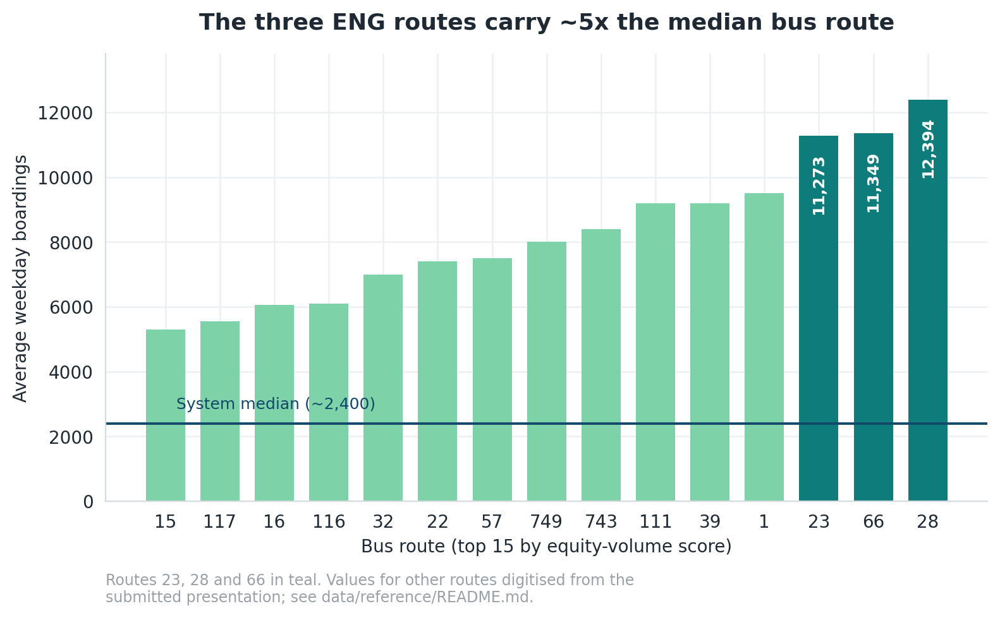
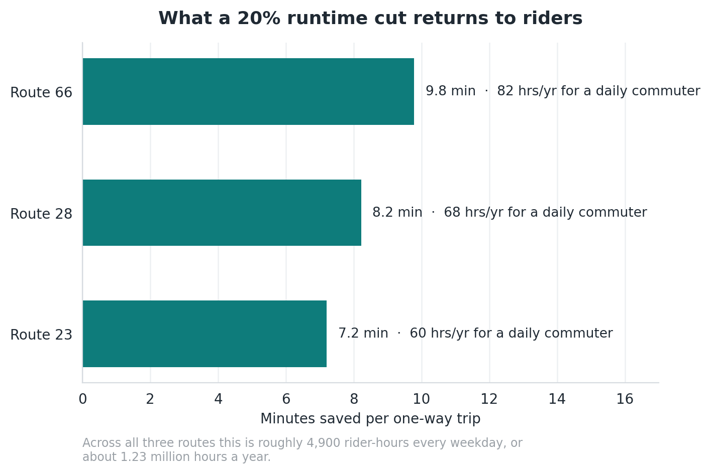

# Results

Everything the analysis produced, in one place. Figures are regenerated from the
CSVs in `data/` by `scripts/make_figures.py`.

---

## 1. Corridor selection

Routes 28, 23 and 66 rank first, second and third out of the entire MBTA bus
network on equity volume — the product of transit dependence and ridership.

| Rank | Route | TDI | Equity volume | Corridor |
| ---: | ---: | ---: | ---: | --- |
| 1 | 28 | 3.00 | 157,355 | Blue Hill Ave / Warren St |
| 2 | 23 | 2.98 | 137,309 | Blue Hill Ave / Warren St |
| 3 | 66 | 2.48 | 124,546 | Allston–Brookline–Roxbury crosstown |
| 4 | 1 | 2.45 | 103,002 | |
| 5 | 39 | 2.43 | 93,381 | |
| 6 | 743 | 2.71 | 92,083 | |
| 7 | 111 | 2.22 | 90,731 | |
| 8 | 22 | 2.76 | 87,782 | |
| 9 | 749 | 2.56 | 87,228 | |
| 10 | 57 | 2.33 | 82,154 | |

*Equity-volume scores use the pre-correction ridership basis on which the
original ranking was computed. See [`reproducibility.md`](reproducibility.md).*

A TDI of 3.00 means Route 28's catchment is three times as transit-dependent as
the MBTA service area average across no-vehicle, low-income, non-white and
transit-commute shares.

The product is doing real work. Route 15 has the second-highest TDI in the group
and ranks fourteenth on equity volume, because barely anyone rides it.

The three ENG routes each carry 11,000–12,400 average weekday boardings against a
system median of roughly 2,400 — about five times the median route.

---

## 2. The service deficit

The highest-need routes are also among the slowest and least reliable.

| Route | Peak runtime (min) | Peak OTP | Off-peak OTP |
| ---: | ---: | ---: | ---: |
| 66 | 48.66 | 0.723 | 0.707 |
| 28 | 40.38 | 0.764 | 0.782 |
| 23 | 35.39 | 0.775 | 0.802 |
| 39 | 34.28 | 0.714 | 0.698 |
| 22 | 33.24 | 0.730 | 0.764 |
| 57 | 30.12 | 0.724 | 0.705 |
| 111 | 26.49 | 0.771 | 0.825 |
| 15 | 25.26 | 0.786 | 0.752 |
| 32 | 18.33 | 0.703 | 0.761 |
| 1 | — | 0.763 | 0.703 |

Route 1 has no full-trip runtime because of incomplete timepoint coverage in the
performance feed. It is missing, not fast.

Route 66 is the clear outlier: roughly 49 minutes at peak with the worst on-time
performance in the group, on a route where 60% of boardings happen next to a rail
station.

---

## 3. Operating economics

| Route | All-day runtime (min) | Trips/weekday | Revenue hours/weekday | Operating cost/weekday |
| ---: | ---: | ---: | ---: | ---: |
| 66 | 48.94 | 208.75 | 170.29 | $50,576 |
| 28 | 41.10 | 192.54 | 131.89 | $39,171 |
| 23 | 36.04 | 205.53 | 123.47 | $36,671 |
| **Total** | | | **425.65** | **$126,418** |

At $297 per bus revenue hour, the three routes cost about **$31.6 million a year**
to operate.

Cost per rider is **$3.16–$4.46** across the three routes. This reframes them
politically: these are not expensive routes per passenger. Slowness is what makes
them expensive per *hour*.

---

## 4. Who rides, and where they work

**Wages.** ENG corridor residents hold more low- and mid-wage jobs than the state
average and fewer high-wage ones.

| Group | Total jobs | Low wage | Mid wage | High wage |
| --- | ---: | ---: | ---: | ---: |
| ENG corridor residents | 116,347 | **13.4%** | **21.5%** | 65.1% |
| Rest of Massachusetts | 3,040,664 | 12.3% | 19.7% | **68.0%** |

**Sectors.** Corridor residents are concentrated in health care, education and
professional services — sectors with shift work, irregular hours, and heavy
dependence on early-morning and late-evening service.

**The key finding.** The corridor is itself a major job centre: over 69,000 health
and social assistance jobs and nearly 58,000 accommodation and food service jobs
are located inside it. And yet **only about one quarter** of the jobs held by
corridor residents are inside the corridor. Residents work at more than 12,000
distinct workplace blocks.

Most riders are passing through to somewhere else, usually via a rail transfer.
That is why this is a network intervention, not a local one.

**Rail connectivity.** 905 of 7,147 MBTA bus stops sit within 400 m of rail, but
on the ENG routes the share of *boardings* at those stops is far higher, because
near-rail stops are the busy ones.

| Route | Share of boardings near rail |
| ---: | ---: |
| 66 | 59.5% |
| 1 | 55.3% |
| 23 | 50.2% |
| 28 | 43.1% |
| 111 | 15.5% |

---

## 5. What the intervention delivers

A 20% runtime reduction returns 7–10 minutes per one-way trip.

For someone commuting both ways five days a week, that is **60 to 82 hours a
year** — one and a half to two working weeks. Across all three routes it is about
**4,900 rider-hours every weekday**, or **1.23 million a year**.

---

## 6. The fiscal case

| | |
| --- | ---: |
| Capital cost (10 mi quick-build + 30% soft costs) | **$6.5M** |
| Bus-hours freed per weekday | 85.1 |
| Gross operating savings per year | $6.32M |
| — less 50% reinvested in service | |
| **Net operating savings per year** | **$3.16M** |
| **New rail fare revenue per year** | **$0.56M** |
| **Total direct benefit per year** | **$3.72M** |
| **Payback** | **1.7 years** |
| **10-year NPV (4% real)** | **$23.8M** |
| Rider-hours saved per year | 1.23M |
| Rider time value per year | $12.3M – $24.5M |
| Capital cost per annual rider-hour saved | $5.30 |

Payback and NPV count MBTA cash flows only. Rider time value is a societal
benefit, not agency revenue, and is deliberately excluded.

### Does it hold up?

| Runtime reduction | Direct benefit/year | Payback | 10-year NPV |
| ---: | ---: | ---: | ---: |
| 5% | $1.36M | 4.8 yr | $4.5M |
| 10% | $2.15M | 3.0 yr | $10.9M |
| 15% | $2.94M | 2.2 yr | $17.3M |
| **20%** | **$3.73M** | **1.7 yr** | **$23.8M** |
| 25% | $4.52M | 1.4 yr | $30.2M |
| 30% | $5.31M | 1.2 yr | $36.6M |

The package pays back inside five years even at a **5% runtime reduction** —
well below the bottom of the 10–25% range documented for comparable projects. The
recommendation does not depend on the optimistic end of the evidence.

A deliberately pessimistic scenario — 10% speed gain, 5% ridership uplift, 8%
discount rate, $250/hour operating cost — still pays back in under five years
with a positive NPV. That case is asserted in the test suite.

---

## 7. Implementation

**Phase 1 (Year 1)** — Design and quick-build on 23/28. Focus on Blue Hill Ave
and Warren St: continuous bus lanes where feasible, TSP at the top delay
intersections, stop optimisation.

**Phase 2 (Year 2)** — Extend to Route 66. Identify 3–4 highest-delay segments
around Harvard Ave, Brookline Village and Roxbury Crossing. Combine bus lanes,
queue jumps and off-board payment.

**Phase 3 (Year 3+)** — Job-access targeting. Use refined GTFS and LODES analysis
to prioritise remaining gaps in access to major health and education employers,
escalating to more capital-intensive upgrades where justified.

| Risk | Mitigation |
| --- | --- |
| Local opposition to lane reallocation and parking loss | Before-and-after data from comparable Boston projects showing improved travel times and minimal business impact; loading zones and side-street parking management |
| MBTA capacity constraints (operators, mechanics) | ENG *reduces* operator hours for the same service, or allows more service with the same workforce — it works with the staffing constraint rather than against it |
| Uncertain ridership rebound | The corridor targets already-high-ridership routes with robust transit dependence, limiting downside |

**Future considerations.** Explore a permanent fare-free policy on Route 66, given
how little corridor revenue actually comes from fares. Extend the package to other
high-ridership corridors — Routes 1, 117, 39.
