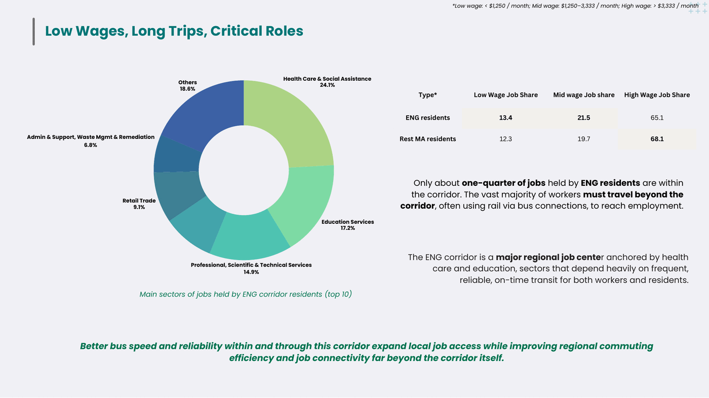
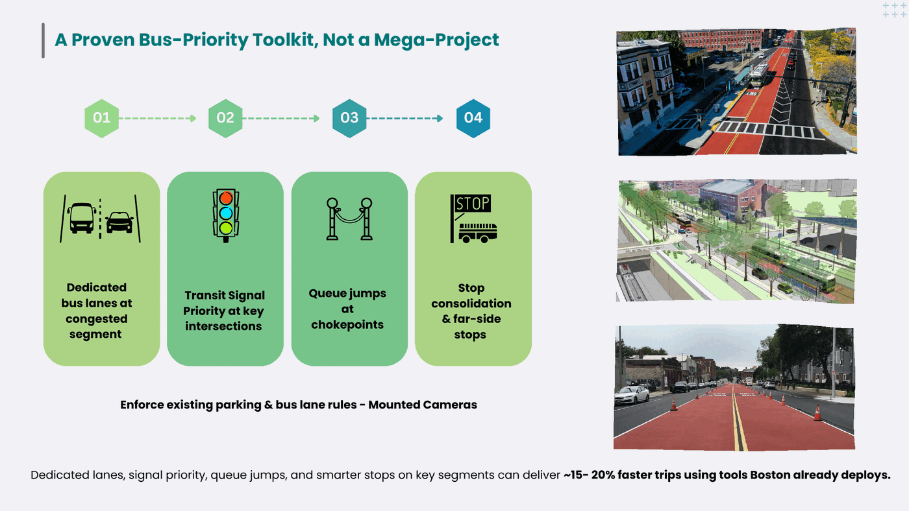
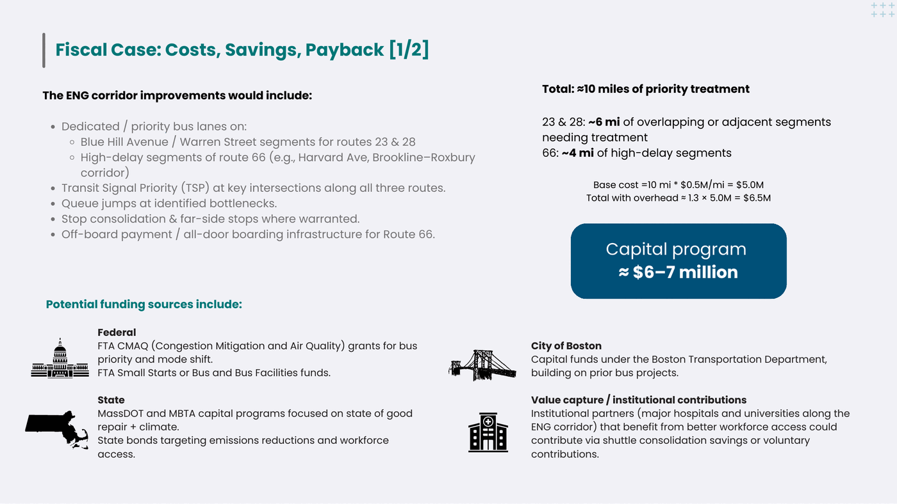
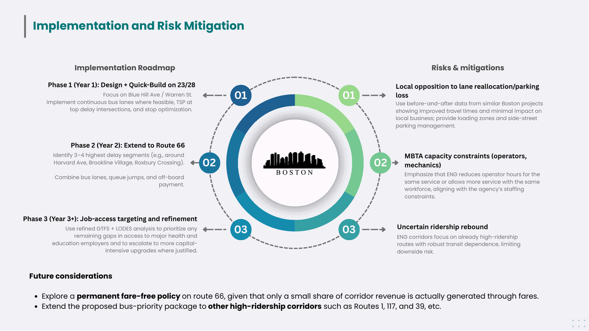
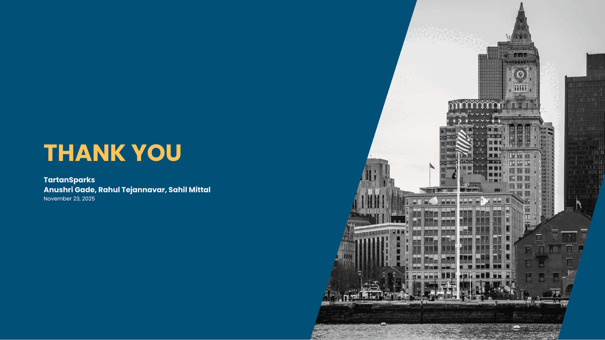

# The deck

Presented to the judging panel at the MIT Policy Hackathon, 23 November 2025.
Nine slides, eight minutes.

📥 [**Download the original PDF**](TartanSparks-MIT-Policy-Hackathon-2025.pdf) (4 MB)
· 📄 [Read the memo instead](../policy-memo.md)
· 📈 [See the full results](../results.md)

---

### 1 · The ask

Three numbers, chosen because they answer the three questions a transit board
actually asks: does it work, who does it help, and when does it pay for itself.

---

### 2 · Why these corridors matter

Routes 23, 28 and 66 each carry 11,000–12,400 average weekday boardings against a
system median of roughly 2,400 — about five times the median bus route. Their
riders disproportionately live in zero-car, low-income, majority-non-white
households, and get slower and less reliable service than the system average.

---

### 3 · How we identified them

Two steps. A **Transit Dependence Index** built from four census measures within
an 800 m walkshed of every stop, normalised against the system average, then
multiplied by ridership to give an equity-volume score. Then a check on what
service those riders actually receive.

The three highest-need corridors turned out to be among the slowest in the
network.

---

### 4 · Who rides, and where they work

The corridor is a major health-and-education job centre, and yet only about a
quarter of the jobs held by corridor residents are inside it. Most riders are
passing through — usually via a rail transfer — which is why this is a network
intervention rather than a local one.

---

### 5 · The toolkit

Not a megaproject. Dedicated lanes on congested segments, transit signal
priority, queue jumps at bottlenecks, far-side stops and stop consolidation —
tools Boston already deploys, delivering 15–20% faster trips.

---

### 6 · What it costs

Ten miles of quick-build priority treatment at roughly $0.5M per mile, plus 30%
for signals, TSP hardware, stops and design. A **$6–7 million** capital program,
with federal, state, city and institutional funding routes.

---

### 7 · What it returns

85.1 bus-hours freed every weekday. $6.32M gross, $3.16M net after reinvesting
half into service. A 10-year NPV of about $23 million against a one-time $6.5
million cost — before counting the 1.23 million rider-hours returned to
passengers each year.

---

### 8 · How it gets built, and what could go wrong

Three phases over three years, starting with quick-build on the 23/28 spine.
Plus the three objections we expected: parking loss, MBTA staffing constraints,
and uncertain ridership recovery.

---

### 9

---

The analysis behind these slides is in [`../methodology.md`](../methodology.md).
What could not be recovered after the event, and three things that do not
reconcile, are documented in
[`../reproducibility.md`](../reproducibility.md).
